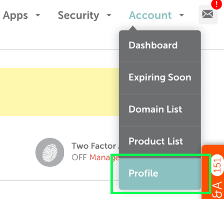
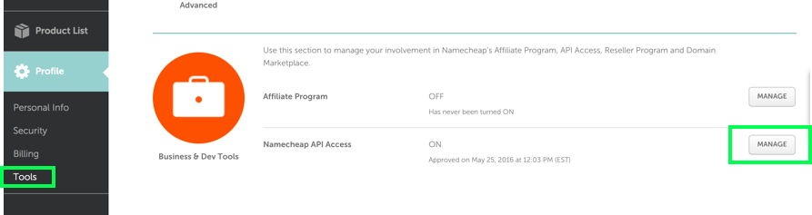
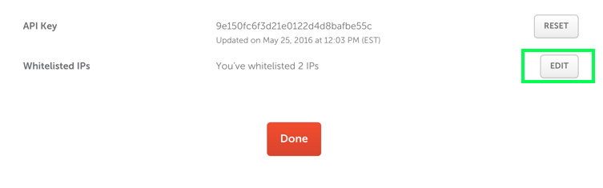

Namecheap API for Python
===========

PyNamecheap is a Namecheap API client in Python.
API itself is documented at <https://www.namecheap.com/support/api/intro/>

This client supports:
-   Registering a domain
-   Checking domain name availability
-   Listing domains you have registered
-   Getting contact information for a domain
-   Setting DNS info to default values
-   Set DNS host records

### Installation

Thanks to @inomoz, as simple as:

```
pip install PyNamecheap
```

### How to sign up to start using the API

The API has two environments, production and sandbox. Since this API will spend real money when registering domains, start with the sandbox by going to <http://www.sandbox.namecheap.com/> and creating an account. Accounts between production and sandbox are different, so even if you already have a Namecheap account you will need a new one.

After you have an account, go to "Profile".



From there, select the "Profile" menu again, then "Tools". Scroll to the bottom of the page to the "Business & Dev Tools" and select "Manage" on the "Namecheap API Access" section.



You'll get to your credentials page. From here you need to take note of your api key, username and add your IP to the whitelist of IP addresses that are allowed to access the account. You can check your public IP by searching "what is my ip" on Google and add it here. It might take some time before it actually starts working, so don't panic if API access doesn't work at first.



### How to access the API from Python

Copy namecheap.py to your project. In Python you can access the API as follows:

    from namecheap import Api
    api = Api(username, api_key, username, ip_address, sandbox = True)

The fields are the ones which appear in the credentials screen above. The username appears twice, because you might be acting on behalf of someone else.

### Registering a domain name using the API

Unfortunately you need a bunch of contact details to register a domain, so it is not as easy as just providing the domain name. In the sandbox, the following contact details are acceptable. Trickiest field is the phone number, which has to be formatted as shown.

    api.domains_create(
        DomainName = 'registeringadomainthroughtheapiwow.com',
        FirstName = 'Jack',
        LastName = 'Trotter',
        Address1 = 'Ridiculously Big Mansion, Yellow Brick Road',
        City = 'Tokushima',
        StateProvince = 'Tokushima',
        PostalCode = '771-0144',
        Country = 'Japan',
        Phone = '+81.123123123',
        EmailAddress = 'jack.trotter@example.com'
    )

This call should succeed in the sandbox, but if you use the API to check whether this domain is available after registering it, the availability will not change. This is normal.

### How to check if a domain name is available

The domains_check method returns True if the domain is available.

    api.domains_check(domain_name)

You can also pass a list of domain names, in which case it does a batch check for all and returns a dictionary of the answers.
You should probably not be writing a mass domain checking tool using this, it is intended to be used before registering a domain.

### CLI tool usage

First, you need to edit `./credentials.py` file to provide API access for the script. The example is following:

    #!/usr/bin/env python

    api_key = '0123456789abcdef0123456789abcdef'
    username = 'myusername'
    ip_address = '10.0.0.1'

Then you just call the script with desired arguments:

    ./namecheap-api-cli --domain example.org --list

    ./namecheap-api-cli --domain example.org --add --type "A" --name "test" --address "127.0.0.1" --ttl 300
    ./namecheap-api-cli --domain example.org --add --type "CNAME" --name "alias-of-test" --address "test.example.org." --ttl 1800

    ./namecheap-api-cli --domain example.org --delete --type "CNAME" --name "alias-of-test" --address "test.example.org."
    ./namecheap-api-cli --domain example.org --delete --type "A" --name "test" --address "127.0.0.1"

### Basic host records management code

Here's the example of simple DNS records management script:

    #!/usr/bin/env python

    """
    Define variables regarding to your API account:
      - api_key
      - username
      - ip_address
    """

    api = Api(username, api_key, username, ip_address, sandbox=False)

    domain = "example.org"

    # list domain records
    api.domains_dns_getHosts(domain)

    record = {
        # required
        "Type": "A",
        "Name": "test1",
        "Address": "127.0.0.1",

        # optional
        "TTL": "1800",
        "MXPref": "10"
    }

    # add A "test1" record pointing to 127.0.0.1
    api.domains_dns_addHost(domain, record)

    # delete record we just created,
    # selecting it by Name, Type and Address values
    api.domains_dns_delHost(domain, record)

### Retry mechanism

Sometimes you could face wrong API responses, which are related to server-side errors.

Thanks to @gstein, we implemented retry mechanism, one could enable it by adding 2 parameters to Api instance:

```
api = Api(username, api_key, username, ip_address, sandbox=False,
          attempts_count=3,
          attempts_delay=0.1)
```

Values of 2 or 3 should do the thing.

### More

Look at namecheap_tests.py to see more examples of things you can do.
